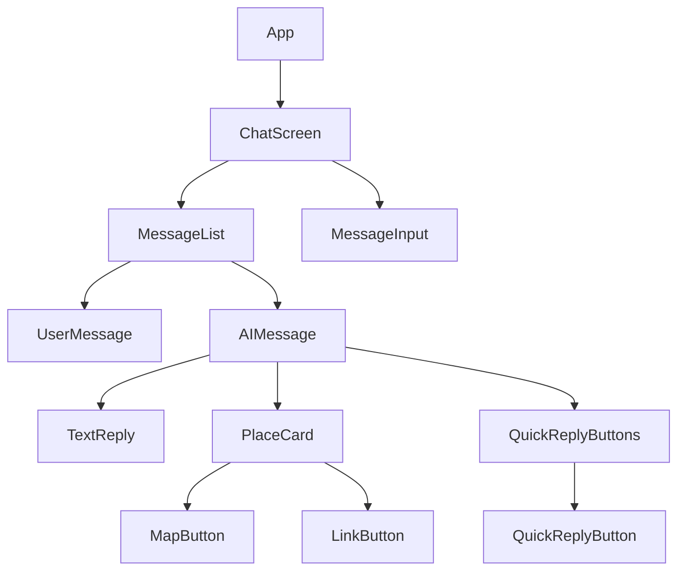
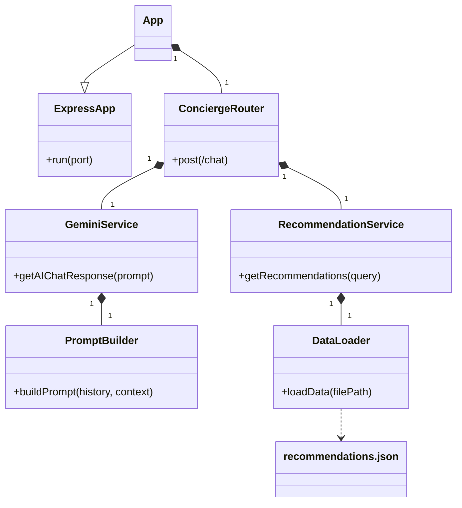

# 3. 技術仕様

## 3.1 フロントエンド技術仕様

### 3.1.1 使用技術
*   **フレームワーク:** React
*   **言語:** JavaScript (TypeScriptの導入も検討)
*   **状態管理:** ReactのContext APIとuseState/useReducerフックを中心に管理します。グローバルな状態管理が必要な場合は、適宜カスタムフックを作成します。

### 3.1.2 コンポーネント設計 (主要コンポーネント)



**主要コンポーネントの説明:**
*   **`App.js`:** アプリケーションのエントリポイント。ルーティングやグローバルなコンテキストプロバイダを配置します。
*   **`ChatScreen.js`:** チャット画面全体を管理するコンポーネント。`MessageList`と`MessageInput`を配置します。
*   **`MessageList.js`:** メッセージの履歴を表示するリスト。スクロールや新しいメッセージの追加を管理します。
*   **`MessageInput.js`:** ユーザーがメッセージを入力し、送信するためのコンポーネント。テキストエリアと送信ボタンを含みます。
*   **`UserMessage.js`:** ユーザーが送信したメッセージを表示するコンポーネント。
*   **`AIMessage.js`:** AIからの返答を表示するコンポーネント。テキスト応答、`PlaceCard`、`QuickReplyButtons`など、AIのレスポンスタイプに応じて異なるサブコンポーネントをレンダリングします。
*   **`TextReply.js`:** AIからのテキスト返答を表示します。
*   **`PlaceCard.js`:** `place_card`タイプの構造化されたAI返答を表示します。画像、名称、説明、評価、住所、地図ボタン、ウェブサイトリンクボタンなどを含みます。
*   **`QuickReplyButtons.js`:** `quick_reply`タイプの構造化されたAI返答（ボタンのリスト）を表示します。
*   **`MapButton.js`:** `PlaceCard`内に含まれる、地図アプリを開くボタン。
*   **`LinkButton.js`:** `PlaceCard`内に含まれる、指定されたURLを開くボタン。

## 3.2 バックエンド技術仕様

### 3.2.1 使用技術
*   **フレームワーク:** Node.js (Express)
*   **言語:** JavaScript
*   **AI統合:** Google Generative AI SDK を通じた Gemini API
*   **環境変数管理:** `dotenv`

### 3.2.2 ディレクトリ構成 (想定)

```
server/
├── node_modules/
├── package.json
├── index.js             # メインアプリケーションファイル（Expressサーバー設定、ルーティング）
├── routes/              # APIエンドポイントの定義
│   └── concierge.js     # AIコンシェルジュ関連のルーティング
├── services/            # ビジネスロジック、外部API連携
│   └── geminiService.js # Gemini APIとの連携ロジック
│   └── recommendationService.js # 推薦データ（JSON）の読み込み・検索ロジック
├── utils/               # 汎用的なユーティリティ関数
│   └── promptBuilder.js # Gemini APIへのプロンプト構築ロジック
├── data/                # 静的データ
│   └── recommendations.json # 施設推薦のスポットリスト
└── .env                 # 環境変数（APIキーなど）
```

### 3.2.3 AIコンシェルジュサービス（Core Logic）

#### a. プロンプトエンジニアリング戦略
Gemini APIへのプロンプトは、以下の要素を動的に組み合わせて構築します。

1.  **システム指示 (System Instruction):**
    *   「あなたは民泊施設のゲストをサポートするフレンドリーなコンシェルジュです。」
    *   「ゲストの滞在を最高の体験にすることがあなたの使命です。」
    *   「質問には具体的に、かつ親身になって答えてください。」
    *   「最終的な回答は日本語で行ってください。」
2.  **役割定義:**
    *   コンシェルジュの「人格」や「トーン」を設定します（例：丁寧語、フランクな言葉遣いなど）。
3.  **コンテキスト情報:**
    *   **会話履歴:** `conversationHistory` をGemini APIに渡し、過去の会話の文脈を維持します。
    *   **ゲストの好み（将来的に）:** ゲストの過去の質問や選択から学習した好みを渡します。
    *   **施設情報:** 施設名、所在地、特徴などを渡します。
    *   **周辺推薦データ:** `data/recommendations.json`から読み込んだ施設が推薦するスポットリストを渡します。AIはこのリストを優先的に参照し、推薦を行います。
    *   **リアルタイム情報（将来的に）:** 現在時刻、曜日、天気情報などを渡します。
4.  **出力フォーマットの指示:**
    *   AIには、テキスト応答だけでなく、`place_card` や `quick_reply` といった構造化された`suggestions`を出力するよう明示的に指示します。**Gemini APIのFunction Calling機能を活用し、AIが定義されたツール（場所の提案など）を呼び出す形で構造化データを生成させます。**

#### b. レスポンス処理
Gemini APIからの応答は、テキストと、Function Callingによる構造化データが含まれる場合があります。
*   テキスト応答はそのまま `reply` フィールドに格納します。
*   Function Callingによって生成された構造化データ（例: `show_place_card`関数が呼び出された場合）は、`suggestions`配列内の適切な`type`（例: `place_card`）と`data`フォーマットに変換してフロントエンドに返します。

### 3.2.4 バックエンド主要クラス図



**クラスの説明:**
*   **`App`:** Expressアプリケーションのメインインスタンス。サーバーの起動とミドルウェア、ルーティングの適用を管理します。
*   **`ConciergeRouter`:** `/api/concierge` 以下のルーティング（`/chat`など）を定義します。リクエストの検証、`GeminiService`と`RecommendationService`の呼び出し、レスポンスの整形を担当します。
*   **`GeminiService`:** Google Gemini APIとの直接的な連携を行います。`PromptBuilder`を使用してプロンプトを構築し、APIを呼び出し、その応答を処理します。
*   **`RecommendationService`:** 推薦データ（`recommendations.json`など）の読み込み、検索、フィルタリングロジックを提供します。
*   **`PromptBuilder`:** Gemini APIに送信するプロンプト文字列を動的に構築する責務を持ちます。会話履歴、コンテキスト情報、AIへの指示などを組み込みます。
*   **`DataLoader`:** 静的データファイル（JSONなど）を非同期で読み込むための汎用的なユーティリティ。